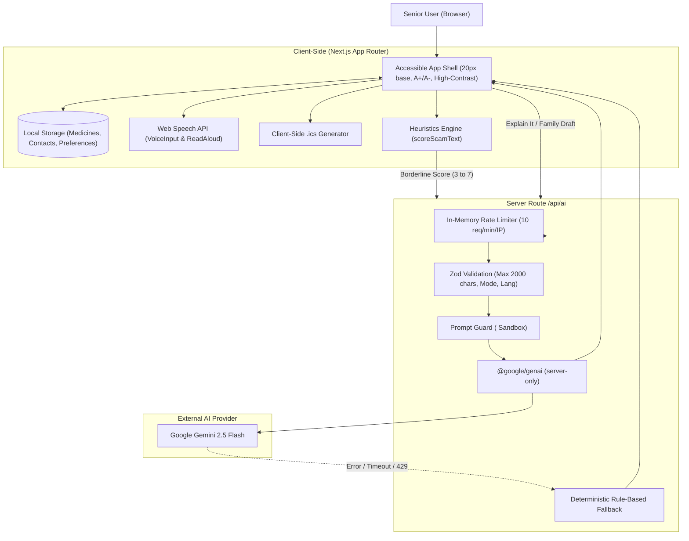

# Saathi (साथी) — GenAI Companion for Older Adults

> **Saathi** (Hindi for *Companion / Partner*) is an accessible, trustworthy, and simple web application designed specifically for seniors and older adults. Rather than exposing an open-ended chatbot that risks confusing users or hallucinating critical guidance, Saathi provides focused, safety-first tools that assist older adults with everyday digital independence.

---

## 1. Problem Statement

Older adults face disproportionate friction and acute vulnerabilities in the modern digital landscape:
- **Predatory Scams:** Seniors are the primary target for phishing, lottery scams, fake utility disconnection threats, and digital arrest coercion. Existing security tools offer vague warnings or technical jargon that creates panic instead of actionable clarity.
- **Cognitive Overload & Complex Bureaucracy:** Medical invoices, pension notices, legal correspondence, and utility bills are filled with confusing terms and hidden deadlines. Generic AI chatbots often provide long-winded answers or dangerous, hallucinated medical/legal advice.
- **Physical & Sensory Barriers:** Small typography, subtle color contrast, tiny touch targets, and complex nested menus make standard web apps difficult or painful to navigate.
- **Social Isolation & Communication Anxiety:** Reaching out to family members or caregivers can be intimidating when trying to articulate an urgent question or asking for assistance with tech.

**Saathi solves this by delivering purpose-built, single-tap assistance with strict guardrails, plain-language outputs, and zero server-side storage of personal data.**

---

## 2. Core Features

### 1. Today (`/`)
- **Calm, Time-Based Greeting:** Personalized based on local device time (Morning, Afternoon, Evening, Night).
- **Next Medicine Alert:** Identifies the closest upcoming dose and provides a one-tap "Mark Taken" button.
- **Missed-Dose Notification:** Prominently alerts the senior if a scheduled dosage time has passed without being confirmed.
- **Daily Scam Defense Tip:** Rotates practical scam-prevention wisdom daily to build digital hygiene over time.
- **Quick Action Links:** High-contrast shortcuts directly to the other primary tools.

### 2. Scam Shield (`/scam-shield`)
- **Heuristics-First Evaluation:** Instant client-side analysis across 8 high-risk scam patterns (urgency tactics, OTP/PIN requests, lottery claims, remote desktop software, gift card/UPI coercion, arrest/disconnection threats, suspicious URLs, and authority impersonation).
- **Two-Tier Architecture:** Definite safe or high-risk inputs are scored immediately; borderline messages route to Gemini 2.5 Flash for nuanced analysis.
- **Plain-Language Verdict:** Tri-state indicator (**Safe [✓]**, **Suspicious [!]**, or **Dangerous [⚠]**) accompanied by a clear "Why" explanation and up to 3 numbered immediate action steps.
- **Emergency Escalation:** Direct "Call My Family" button prominently displayed on any suspicious or dangerous verdict.

### 3. Explain It (`/explain-it`)
- **Document & Letter Simplifier:** Converts complex letters, official notices, bills, or medicine labels into plain language calibrated for a 12-year-old reading level.
- **Structured Extraction:**
  - Plain English Summary
  - "What they want from me" (explicit obligations or requirements)
  - Deadline / Due Date
  - Safest next step
  - Exactly 3 practical questions to ask a trusted contact or provider
- **Client-Side `.ics` Reminder:** Generates and downloads an iCalendar reminder directly in the browser with zero external dependencies.
- **Prominent Disclaimers:** Explicitly reminds the user that Saathi is a companion, not a substitute for a doctor, lawyer, or certified financial planner.

### 4. Medicines (`/medicines`)
- **Zero-Friction Schedule Tracker:** Add medications with dosage and reminder times.
- **One-Tap "Mark Taken" State:** Large 48px+ touch targets with instant confirmation.
- **Local Persistence:** All schedule and adherence data is maintained exclusively in device `localStorage`.
- **Missed Dose Highlighting:** Clear visual and textual warnings if a dose was not marked taken before its scheduled time.

### 5. Family & Support (`/family`)
- **One-Touch Emergency & Check-In Hub:** Stores up to 4 trusted primary contacts (family members, caregivers, or physicians).
- **Direct Calling & Messaging:** Instant `tel:` protocol dialer and pre-formatted `https://wa.me/` WhatsApp messaging buttons.
- **"Help Me Write a Message" Assistant:** Converts senior thoughts or spoken dictation into polite, concise messages ready to send to family via WhatsApp or clipboard copy.

---

## 3. Architecture & Data Flow



### Key Architectural Decisions
1. **Server-Only LLM Boundary:** `@google/genai` is isolated in `src/lib/gemini.ts` marked with `import "server-only";`. API keys never leak to client bundles.
2. **Zero Server Persistence:** Saathi has no database. Personal details, medicine names, contact numbers, and schedule times remain strictly inside the user's browser `localStorage`.
3. **Graceful Fallbacks:** If the internet connection drops, the Gemini API experiences an outage, or rate limits are exceeded, the API and client instantly return deterministic, helpful rule-based fallbacks. The senior never encounters a raw error or blank screen.

---

## 4. Accessibility (A11y) Choices

Saathi was designed from the ground up for older adults with varying visual, motor, and cognitive capabilities:

- **20px Base Font Size:** Standard text is significantly larger than typical web applications for comfortable reading without straining.
- **Dynamic Text Size Adjustment:** One-click **A-** and **A+** controls adjust the root font size, with preferences saved locally.
- **High-Contrast Palette:** A dedicated high-contrast toggle enforces dark backgrounds with crisp yellow and white elements exceeding WCAG AAA contrast ratios (>= 7:1).
- **Minimum 48px Interactive Targets:** Every button, link, and input meets or exceeds the 48×48px physical touch target requirement.
- **Never Rely on Color Alone:** All status messages, verdicts, and medicine states combine clear iconography, text labels, and semantic styles.
- **Voice Dictation (`VoiceInput`):** Integrated via the Web Speech API (`webkitSpeechRecognition` / `SpeechRecognition`), allowing hands-free text entry with graceful fallback messaging if unsupported.
- **Text-to-Speech (`ReadAloud`):** Integrated via `window.speechSynthesis` with speech rate calibrated to 0.9x for clear, unhurried listening.
- **Screen Reader Announcements (`aria-live`):** Form updates, voice transcription confirmations, and analysis results announce changes politely without interrupting user focus.
- **Keyboard Navigation & Skip Link:** Direct skip navigation link to `#main-content`, natural tab order, and prominent high-contrast focus rings (`outline: 3px solid #2563eb`).
- **Reduced Motion:** Fully honors `prefers-reduced-motion: reduce` by disabling smooth transitions.

---

## 5. Security & Safety Principles

1. **API Key Protection:** `GEMINI_API_KEY` is accessed exclusively in Node.js server runtime. No client component or environment variable leaks the credential.
2. **Prompt Injection Mitigation:** All user text is wrapped in `<user_text>` and `</user_text>` XML delimiters with explicit instructions to treat encapsulated text strictly as untrusted data.
3. **Structured Response Guarantees:** Using Gemini SDK's `responseSchema` and Zod runtime parsing ensures the LLM cannot return unexpected executable scripts or malformed JSON.
4. **Input Constraints:** Strict Zod schema limits incoming requests to 2,000 characters and validates mode enumerations.
5. **In-Memory IP Rate Limiting:** Enforces a sliding window limit of 10 requests per minute per IP address, responding with HTTP 200 containing fallback data and a `Retry-After` header.
6. **Hardened HTTP Security Headers:**
   - `Content-Security-Policy`: Restricts scripts, objects, frames, and connections to trusted origins.
   - `Permissions-Policy`: Restricts camera and geolocation, strictly permitting `microphone=(self)` for voice dictation.
   - `X-Frame-Options: DENY`: Prevents clickjacking attacks.
   - `X-Content-Type-Options: nosniff`: Prevents MIME-type sniffing.
   - `Strict-Transport-Security`: Enforces HTTPS.
7. **Refusal to Advise:** Saathi strictly avoids offering conclusive legal, medical, or financial verdicts, always directing the senior to contact a trusted loved one or qualified professional.

---

## 6. How to Test

Saathi includes an automated test suite featuring unit tests, schema validation, rate-limiter verification, heuristic tests, and automated **`jest-axe`** accessibility tests on all pages.

### Running the Vitest Suite
```bash
npm test
```

### Test Coverage Highlights
- **Heuristics (`src/lib/heuristics.test.ts`):** Verifies scam detection across urgency, OTP requests, prize claims, threats, and safe family messages.
- **Schemas (`src/lib/schemas.test.ts`):** Verifies Zod validation for valid requests, character limits, invalid modes, and response parsing.
- **Rate Limiter (`src/lib/ratelimit.test.ts`):** Verifies request counting, window expiry, and retry-after calculations.
- **Fallback (`src/lib/fallback.test.ts`):** Ensures all modes return safe fallback payloads.
- **Medicines Logic (`src/lib/medicines.test.ts`):** Tests next-dose calculations and missed-dose detection across clock boundaries.
- **iCalendar Generator (`src/lib/calendar.test.ts`):** Tests `.ics` content formatting, line breaks, and date parsing.
- **Automated A11y Suite (`*.test.tsx`):** Every page (`Today`, `Scam Shield`, `Explain It`, `Medicines`, `Family`) and the `AppShell` run through `axe(container)` with **zero violations**.

---

## 7. How to Run

### Prerequisites
- Node.js 20+ LTS
- npm 10+

### 1. Install Dependencies
```bash
npm install
```

### 2. Configure Environment
Create a `.env.local` file in the root directory:
```env
GEMINI_API_KEY=your_gemini_api_key_here
GEMINI_MODEL=gemini-2.5-flash
```

### 3. Development Mode
```bash
npm run dev
```
Open [http://localhost:3000](http://localhost:3000) in your browser.

### 4. Code Quality & Linting
```bash
npm run lint
```

### 5. Production Build & Start
```bash
npm run build
npm start
```

---

## License

Private / Built for the GenAI Prompt-War Challenge.
Saathi is a helper and companion, not a doctor, lawyer, or financial adviser.
